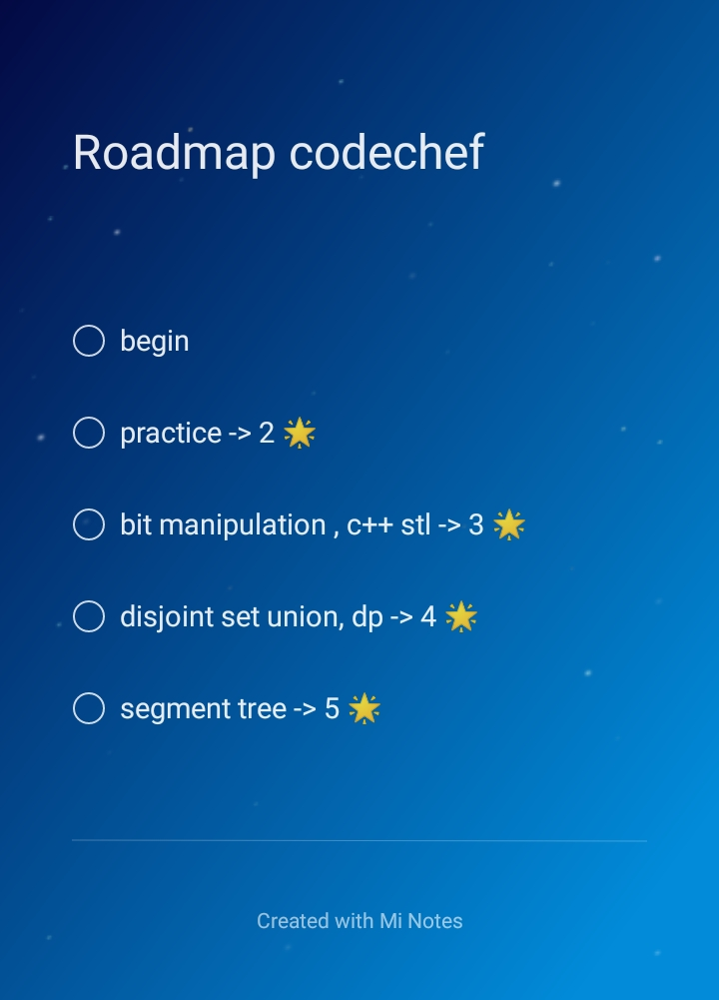

# Competitive-Programming

## python jump by 2
```python:
for i in range(0,10,2):
  print(i)
```
## You might not know this 
https://www.geeksforgeeks.org/heap-using-stl-c/

## how to avoid recursion depth problem in python : 
sys.setrecursionlimit(10 ** 6)
## C++ tricks : 
https://codeforces.com/blog/entry/15643

## roadmap : 
https://blog.shahjalalshohag.com/topic-list/

## cf blogs : 
https://codeforces.com/catalog

## note to me:

* number theory , bit manip and dp are most popular, 
* in 98% of the contest atleast one of them is always there,
* please practise more and more

Some basic constraints and the safe time complexity :
---
| N | Big Oh |
|-----|------|
|For N <= 10 | O(2^N) and O(N!)|
|For N <= 100 | O(N^3) |
|For N <= 10^3 | O(N^2) |
|For N <=10^5 | O(NLogN) [ Sorting/Greedy Algo] |
|For N <= 10^6 | O(N) |
|For N <= 10^9 | O(logN) |

---
# nice youtube channels : 
|channel|
|-------|
|[Tushar Roy](https://www.youtube.com/channel/UCZLJf_R2sWyUtXSKiKlyvAw)|
|[Striver](https://www.youtube.com/channel/UCJskGeByzRRSvmOyZOz61ig)|
|[CodeNCode](https://www.youtube.com/channel/UC0zvY3yIBQTrSutsV-4yscQ)|
|[Tech-Dose](https://www.youtube.com/channel/UCnxhETjJtTPs37hOZ7vQ88g)|
|[Luv](https://www.youtube.com/channel/UCDzhFuVYou1D8w1ABZo3b9A)|
|[Apna college Placement course](https://www.youtube.com/playlist?list=PLfqMhTWNBTe0b2nM6JHVCnAkhQRGiZMSJ)|
|[Errichto](https://www.youtube.com/channel/UCBr_Fu6q9iHYQCh13jmpbrg)|


# Other nice repos : 
| repo |
|------|
|[Tourist](https://github.com/the-tourist/algo)|
|[dhiraj-01 CP](https://github.com/dhiraj-01/CP)|
|[Ashish Gupta](https://github.com/Ashishgup1/Competitive-Coding)|
|[Leetcode questions](https://github.com/fterh/leetcode-curation-topical)|
|[Algo-lib](https://github.com/saketh-are/algo-lib)|
|[Coding notes](https://github.com/ankitpriyarup/Coding_Notes)|
|[Atcoder library](https://github.com/atcoder/ac-library)|
|[Alexandru Valeanu](https://github.com/AlexandruValeanu/Competitive-Programming)|

---

# important topic reference 

|topic ref link|
|--------------|
|[Dynamic programming](https://youtu.be/oBt53YbR9Kk)|
|[Maths for dsa & cp](https://www.youtube.com/watch?v=tDM6lT-qjys)|

---
# nice articles 
|article ref link|
|----------------|
|[Roadmap for cp](https://www.geeksforgeeks.org/competitive-programming-a-complete-guide/)|
|[modulo multiplicative inverse](https://www.geeksforgeeks.org/modular-multiplicative-inverse-1-n/)|
---
# Important links : 
https://leetcode-questions.herokuapp.com/

# Problem sheet : 
https://cses.fi/problemset/

# contest : 
https://clist.by/

---
## good to know
- at max a number can have O(2*sqrt(n)-1) factors , which number of factors' upper bound .
---
# Roadmap

---
## number theory and combinatorics
| topic | ref link |
| ----- |----------|
|prime number||

---
| topic | ref link |
| ----- |----------|


